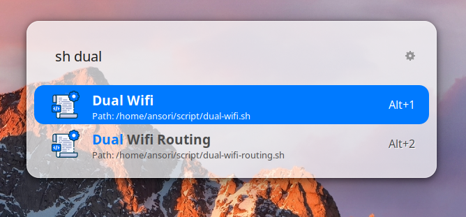

# 🚀 Personal Script Runner

A lightweight Ulauncher extension to run your personal `.sh` script collection quickly.

## ✨ Why
If you keep handy shell scripts for everyday tasks (open projects, toggle services, sync notes, etc.), this extension helps you trigger them from Ulauncher without remembering paths or typing long commands.

## Overview

## Requirements
- Ulauncher (v5 recommended)
- A Linux shell environment
- Executable shell scripts (`chmod +x your-script.sh`)

## 🛠 Installation
### Via Ulauncher (Easiest)
1. Open Ulauncher Preferences.
2. Go to the **Extensions** tab.
3. Click **Add extension**.
4. Paste the repository URL: `https://github.com/oriewancu/ulauncher-ext-sh-runner`
5. Click **Add**.

### From source (recommended for development)
1. Open your Ulauncher extensions folder:
    - `~/.local/share/ulauncher/extensions/`
2. Clone this repository into that directory:
    - `git clone https://github.com/oriewancu/ulauncher-ext-sh-runner`
3. Restart Ulauncher.

### Update
Pull the latest changes:
- `git pull`

---

## ⚙️ Configuration
After installation, go to **Ulauncher Preferences > Extensions** to configure your paths:
- **Scripts Directory**: Path where your `.sh` files are stored.
- **Terminal Emulator**: Command for your terminal (e.g., `gnome-terminal`).

---

## 📖 Usage
1.  **Prepare Scripts**: Place your `.sh` scripts in a dedicated folder on your system, such as `~/script` or `$HOME/script`.
2.  **Configure**: Open Ulauncher Preferences, navigate to the **Extensions** tab, and set the **Scripts Directory** to your folder path.
3.  **Launch**: Trigger the extension with your keyword (e.g., `sh` and then press space), search for the desired script, and press Enter to execute.

> 💡 **Tip**: Ensure your scripts include a proper shebang (e.g., `#!/usr/bin/env bash`) and are compatible with the shell you are using.

---

## 🛠 Troubleshooting
* **Script fails to launch**:
    * Verify that the script is executable: `chmod +x your-script.sh`.
    * Test running the script manually in a terminal to catch syntax errors.
* **Permission denied**:
    * Double-check file permissions and ensure Ulauncher has the necessary rights to access the folder.
* **Environment inconsistencies**:
    * Ulauncher may not load all your shell aliases or variables.
    * **Solution**: Explicitly source your profile (e.g., `source ~/.bashrc`) or define required variables directly within the script.

---

## 🏗 Development
The extension structure follows the standard Ulauncher API v2.0.0:

* **`main.py`**: Contains the core extension logic and event listeners.
* **`manifest.json`**: Defines the extension metadata, keyword triggers, and user preferences.
* **`images/`**: Stores visual assets like the extension icon and screenshots.

---

## 📄 License
See `LICENSE`.
